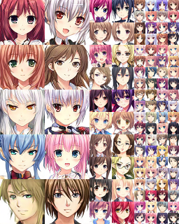
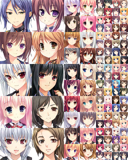
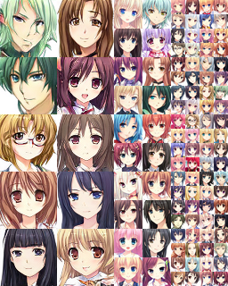
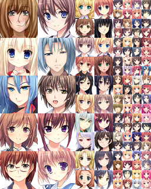

# Anime-GAN

# Sprint 1

## Recherches sur le fonctionnement des GANs

Afin de sélectionner le modèle adéquat, nous avons dus nous documenter sur [l'état de l'art des GANs](https://towardsdatascience.com/must-read-papers-on-gans-b665bbae3317) ainsi que les [évolutions des modèles au cours du temps](https://towardsdatascience.com/explained-a-style-based-generator-architecture-for-gans-generating-and-tuning-realistic-6cb2be0f431).

Deux types de modèle ont donc retenu notre attention par leurs fonctionnement différents, le premier étant le [DCGAN](https://arxiv.org/pdf/1511.06434) et le second étant le [style-gan](https://arxiv.org/pdf/1812.04948).

## Le dataset

Nous sommes partis en quête de différents datasets d'anime. 
L'un des plus volumineux que nous ayons trouvé est le [Danbooru 2018](https://www.gwern.net/Danbooru2018) avec environ 300 Gb d'images en tout genre et annotées. Le principal problème étant que les images sont très diverses, en plus d'être de tailles différentes, ce qui aurait rendu le pré-processing très fastidieux.

Nous avons finalement opté pour le [Anime face dataset](https://github.com/Mckinsey666/Anime-Face-Dataset), qui, malgré quelques coquilles sur son contenu (présences d'images de seins et de fesses parmi les visages) est de bonne qualité. Néanmoins les images sont de tailles assez petites (64x64). Ci-dessous se trouve un échantillon du dataset.

## Modèles

Les GANs nécessite une puissance de calcul importante, et entrainer nos modèles sur nos machines n'étaient pas une chose envisageable. Par conséquent, nous avons recherché des offres cloud (amazon, azure, gcloud, paperspace...) accessibles avec GPU pour réduire au maximum les délais d'entraînement. 

Les DCGAN ont étaient entrainés sur une machine mono-gpu (Nvidia K80) tandis que les Style-GAN sur des machines quad-gpus (Nvidia Tesla v100).

### DCGAN

Le DCGAN utilisé est composé de :
* Un generator avec 1 couche dense dont la sortie est reshape en 8x8, et de 4 couches de déconvolution avec du striding qui permet d'obtenir une sortie de 64x64
* Un discriminator avec 2 couches de convolutions

#### Résultats

Nous avons commencé par générer des images en nuances de gris.
Les résultats, bien que pas forcément convaincants, démontrent tout de même l'apparition de certaines "features".
Avec un peu d'imagination, on peut distinguer des formes de bouches, d'yeux et de cheveux.

Une tentative de DCGAN en couleur a également été tenté, mais s'est avérée un peu catastrophique.

### Style-GAN

Le style-gan est basé sur le modèle d'[Nvidia](https://github.com/NVlabs/stylegan).

Nous avons du transformer notre dataset et l'adapter pour l'entrée du modèle, ainsi que paramétrer celui-ci.
Les résultats sont extrêmement convaincant, malgré quelques coquilles.

